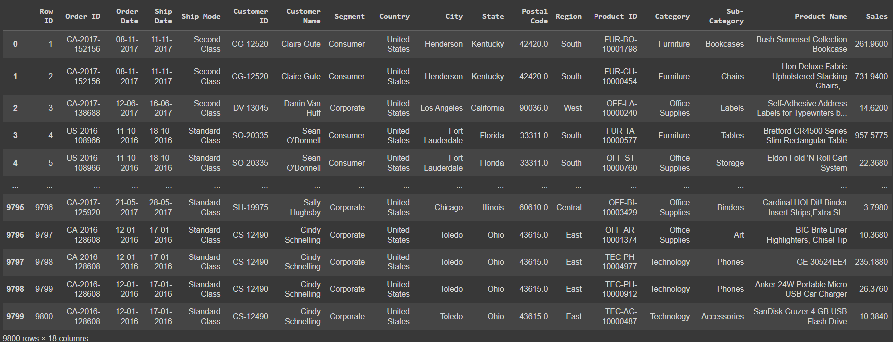
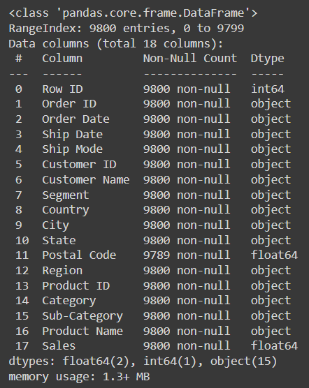
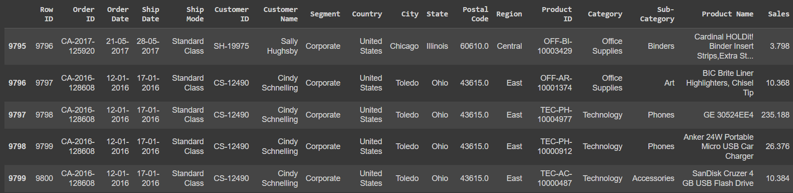
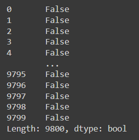
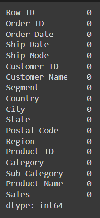
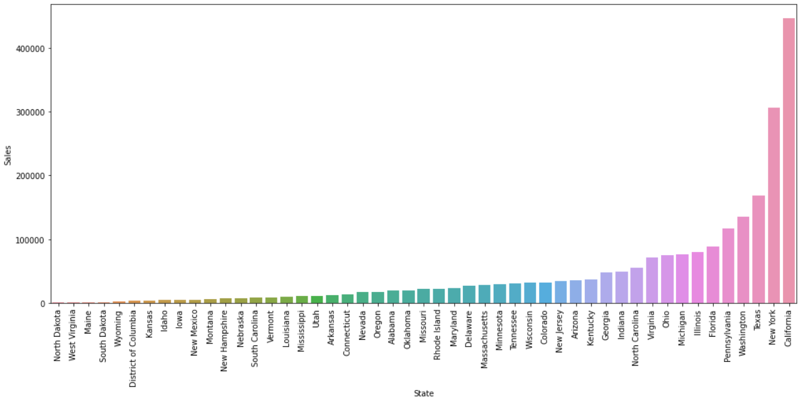
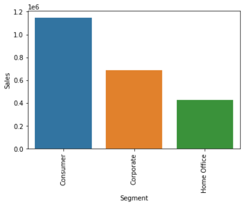
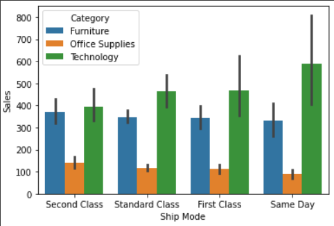
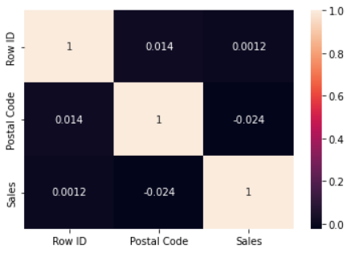
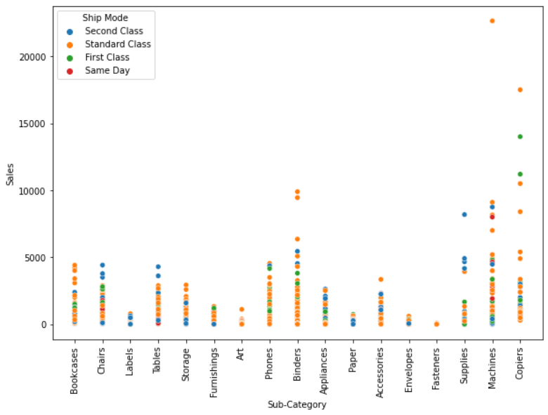

# Ex-04-Multivariate-Analysis
## AIM
To perform Multivariate Exploratory Data Analysis on the given data set.

## EXPLANATION
Exploratory data analysis is used to understand the messages within a dataset. This technique involves many iterative processes to ensure that the cleaned data is further sorted to better understand the useful meaning.The primary aim with exploratory analysis is to examine the data for distribution, outliers and anomalies to direct specific testing of your hypothesis.

# ALGORITHM
## STEP 1
Import the built libraries required to perform EDA and outlier removal.

## STEP 2
Read the given csv file

## STEP 3
Convert the file into a dataframe and get information of the data.

## STEP 4
Return the objects containing counts of unique values using (value_counts()).

## STEP 5
Plot the counts in the form of Histogram or Bar Graph.

## STEP 6
Use seaborn the bar graph comparison of data can be viewed.

## STEP 7
Find the pairwise correlation of all columns in the dataframe.corr()

## STEP 8
Save the final data set into the file

# CODE

```
import pandas as pd
import numpy as np
import seaborn as sns
import matplotlib.pyplot as plt

df = pd.read_csv("C:\Users\vinee\data science\Ex-04-Multivariate-Analysis\SuperStore.csv")
df

df.head()

df.info()

df.describe()

df.tail()

df.shape

df.columns

df.isnull().sum()

df.duplicated()

df['Postal Code'] = df['Postal Code'].fillna(df['Postal Code'].mode()[0])

df.isnull().sum()

states=df.loc[:,["State","Sales"]]
states=states.groupby(by=["State"]).sum().sort_values(by="Sales")
plt.figure(figsize=(17,7))
sns.barplot(x=states.index,y="Sales",data=states)
plt.xticks(rotation = 90)
plt.xlabel=("STATES")
plt.ylabel=("SALES")
plt.show()

states=df.loc[:,["Segment","Sales"]]
states=df.groupby(by=["Segment"]).sum()
sns.barplot(x=states.index,y="Sales",data=states)
plt.xticks(rotation = 90)
plt.xlabel=("SEGMENT")
plt.ylabel=("SALES")
plt.show()

sns.barplot(df["Ship Mode"],df["Sales"],hue=df["Category"])

df.corr()
sns.heatmap(df.corr(),annot=True)

plt.figure(figsize=(10,7))
sns.scatterplot(df['Sub-Category'], df['Sales'], hue=df['Ship Mode'])
plt.xticks(rotation = 90)
```
# OUTPUT
## Dataset

## Dataset Head

## Dataset Info

## Dataset Describe

## Dataset Tail

## Dataset Shape

## Dataset Columns

## Null Values - Pre Cleaning

## Dataset Duplicated

## Null Values - Post Cleaning

## Multivariate Analysis - State

## Multivariate Analysis - Segment

## Multivariate Analysis - Ship Mode & Category vs Sales

## Multivariate Analysis - Heat Map

## Multivariate Analysis - Sub-Category & Ship Mode vs Sales


## RESULT
The given dataset is read and Multivariate analysis is performed. The inferences are:

1. Most sales were from the California State
2. Most sales were from Consumer Segment
3. Most sales were from "New York City"
4. Most Sales were shipped on the Same Day and is most from Technology
5. Highest sale was from Machines Sub-category and is shipped in standard class
